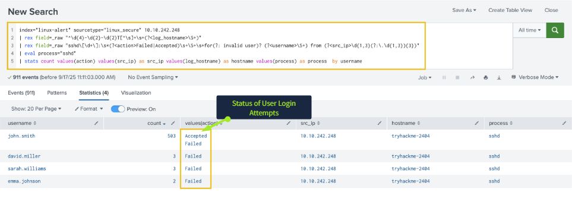
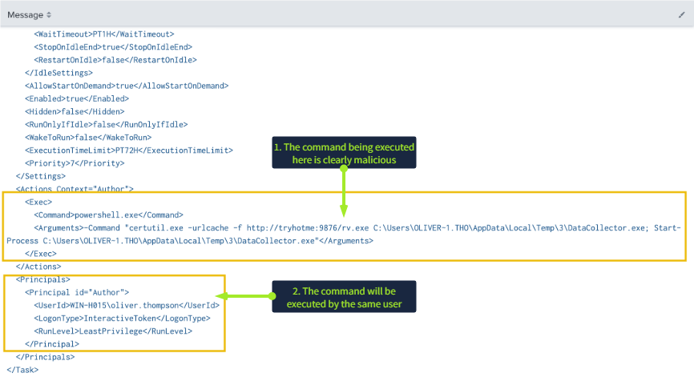
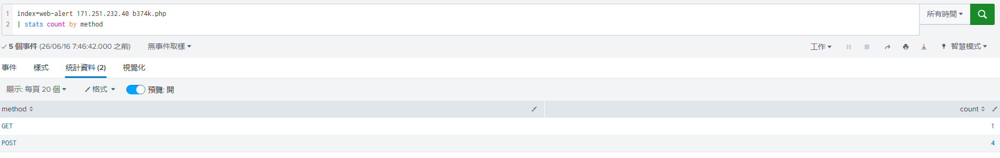

# TryHackMe Lab Report： Alert Triage With Splunk

## 使用 Splunk 進行 SOC 告警分流與初步事件判斷練習

## 1. 執行摘要

本報告整理 TryHackMe「Alert Triage With Splunk」Lab 的練習過程，目標是透過 Splunk 分析不同來源的告警與日誌，練習 SOC 初階分析師在收到警報後，如何進行初步分流、確認事件脈絡，並判斷是否需要進一步處理。

在 Lab 情境中，我依序分析三種常見告警：Linux 帳號疑似暴力破解、Windows 主機出現可疑排程工作，以及 Web 伺服器疑似出現 Web Shell 活動。這次練習的重點不是模擬完整企業事件回應，而是熟悉如何使用 Splunk 查詢語法、欄位擷取、時間線比對與日誌關聯，對告警進行初步判斷。

---

## 2. 分析目標

本次 Lab 的主要學習目標包括：

* 練習使用 Splunk 分析 Linux、Windows 與 Web 伺服器相關告警。
* 熟悉 SOC 告警分流時常見的判斷流程，例如確認來源 IP、目標帳號、事件時間與後續行為。
* 練習使用 `rex` 擷取日誌欄位，並搭配 `stats` 統計異常行為。
* 觀察暴力破解、可疑排程、LOLBins、Web Shell 等常見攻擊跡象。
* 依據 Lab 情境整理 True Positive 判斷依據、初步風險判斷與改善建議方向。

---

## 3. 技術分析過程

### 3.1 Linux 帳號暴力破解告警分析

**分析資料來源：**

```spl
index="linux-alert" sourcetype="linux_secure"
```

**觀察重點：**

在第一個情境中，告警指向來源 IP `10.10.242.248`。我先針對該 IP 搜尋 Linux secure log，觀察是否有異常登入行為。

使用的查詢語法如下：

```spl
index="linux-alert" sourcetype="linux_secure" 10.10.242.248
| rex field=_raw "^\d{4}-\d{2}-\d{2}T[^\s]+\s+(?<log_hostname>\S+)"
| rex field=_raw "sshd\[\d+\]:\s*(?<action>Failed|Accepted)\s+\S+\s+for(?: invalid user)? (?<username>\S+) from (?<src_ip>\d{1,3}(?:\.\d{1,3}){3})"
| eval process="sshd"
| stats count values(action) by username
```

透過統計結果，可以觀察到 `john.smith` 帳號在短時間內出現大量 `Failed password` 紀錄，後續又出現 `Accepted password` 成功登入紀錄。在 Lab 情境中，這代表該帳號可能遭到暴力破解後成功登入。

後續日誌中也觀察到 `session opened for user root` 的紀錄，代表該使用者登入後可能進一步切換至 root 權限，因此需要提高事件嚴重度。

**初步判斷：**

在 Lab 情境中，這個告警可以初步判斷為 True Positive。判斷依據包括：

* 同一來源 IP 對特定帳號出現大量登入失敗。
* 登入失敗後接著出現成功登入。
* 後續出現 root session，代表可能有進一步提權或高權限操作。

**初步風險判斷：**

若在真實環境中出現類似情況，應優先確認該登入是否為合法使用者行為，並檢查來源 IP、帳號使用紀錄、登入時間、主機後續指令與是否有新增帳號或排程任務。



---

### 3.2 Windows 可疑排程工作告警分析

**分析資料來源：**

```spl
index="win-alert"
```

**觀察重點：**

第二個情境的告警指出 Windows 主機 `WIN-H015` 出現可疑排程工作 `AssessmentTaskOne`。我先查詢 Windows Event ID `4698`，確認排程工作建立紀錄。

使用的查詢語法如下：

```spl
index="win-alert" EventCode=4698 AssessmentTaskOne
```

查詢結果顯示該排程工作是由 `oliver.thompson` 帳號建立。接著，我查詢該帳號的登入紀錄，觀察是否有對應的互動式登入或可疑登入行為：

```spl
index="win-alert" EventCode=4624 "oliver.thompson"
```

在事件內容中，可以觀察到該排程工作呼叫了 Windows 內建工具 `certutil.exe`，並從外部下載 `rv.exe`。下載後的檔案被放在 Temp 目錄並命名為 `DataCollector.exe`，後續又透過 PowerShell 執行。

`certutil.exe` 本身是 Windows 合法工具，但在攻擊情境中也可能被濫用來下載或解碼檔案，因此這類行為需要特別檢查。

**初步判斷：**

在 Lab 情境中，這個告警可以初步判斷為 True Positive。判斷依據包括：

* 出現非預期的排程工作建立。
* 排程內容包含從外部下載執行檔。
* 使用 `certutil.exe`、PowerShell 與 Temp 目錄等常見可疑組合。
* 檔案名稱 `DataCollector.exe` 可能帶有偽裝意味。

**初步風險判斷：**

雖然操作帳號是系統工程師帳號，但排程下載不明執行檔並透過 PowerShell 執行，仍然屬於高風險行為。若在真實環境中觀察到類似狀況，應確認該帳號是否遭盜用，並檢查排程內容、下載來源、檔案 Hash、父子程序關係與主機後續外連行為。




---

### 3.3 Web Shell 告警分析

**分析資料來源：**

```spl
index="web-alert"
```

**觀察重點：**

第三個情境中，告警提到惡意情資 IP `171.251.232.40`。我先針對該 IP 查詢 Web 存取日誌，觀察它對 Web 伺服器的請求行為。

在早期紀錄中，可以觀察到該 IP 對 `wp-login.php` 發送大量請求，且 User-Agent 顯示為：

```text
Mozilla/5.0 (Hydra)
```

Hydra 常被用於密碼暴力破解。在 Lab 情境中，這代表該 IP 可能正在對 WordPress 登入頁面進行自動化登入嘗試。

接著，我排除前面的登入嘗試流量，進一步搜尋該 IP 是否有與可疑檔案互動。日誌中出現名為 `b374k.php` 的檔案：

```spl
index=web-alert 171.251.232.40 b374k.php
| stats count by method
```

統計結果顯示，該 IP 對 `b374k.php` 產生了 1 筆 GET 請求與 4 筆 POST 請求。`b374k.php` 是常見 Web Shell 名稱之一，而 POST 請求通常可能用來傳送指令或參數。在 Lab 情境中，這可以視為 Web Shell 被存取與操作的跡象。

**初步判斷：**

在 Lab 情境中，這個告警可以初步判斷為 True Positive。判斷依據包括：

* 惡意情資 IP 曾對 `wp-login.php` 進行大量請求。
* User-Agent 顯示為 Hydra，符合自動化暴力破解工具特徵。
* 後續出現與 `b374k.php` 的互動。
* `b374k.php` 具有 Web Shell 特徵，且出現多筆 POST 請求。

**初步風險判斷：**

若在真實環境中觀察到 Web Shell 檔案被存取，應優先確認該檔案是否真的存在於伺服器目錄中，並檢查其建立時間、擁有者、Web Server 權限、相關上傳紀錄與是否有後續命令執行紀錄。



---

## 4. 攻擊流程整理

依據 Lab 中三個情境觀察到的線索，可以將可能的攻擊流程整理如下：

1. 攻擊者使用自動化工具對 SSH 或 WordPress 登入頁面進行密碼嘗試。
2. 部分帳號在多次登入失敗後出現成功登入紀錄。
3. Linux 主機中出現 root session，代表可能有進一步高權限操作。
4. Windows 主機中出現可疑排程工作，並透過 `certutil.exe` 下載不明執行檔。
5. Web 伺服器中出現疑似 Web Shell 的 `b374k.php`，並有多筆 POST 互動紀錄。
6. 這些行為分別呈現出初始存取、提權、持久化與遠端控制的可能跡象。

---

## 5. MITRE ATT&CK 對應練習

###### 以下對應為依據 Lab 情境進行的初步練習，實際企業事件仍需要搭配更多端點、網路、EDR 與威脅情資資料確認。

| 觀察行為                              | 可能對應技術                                | 說明                                                 |
| --------------------------------- | ------------------------------------- | -------------------------------------------------- |
| SSH 短時間大量登入失敗後成功登入                | Brute Force: Password Guessing        | 針對特定帳號出現多次 Failed password，後續出現 Accepted password。 |
| WordPress 登入頁面出現 Hydra User-Agent | Brute Force                           | Web log 中出現自動化工具對登入頁面進行高頻率請求。                      |
| Linux 使用者開啟 root session          | Abuse Elevation Control Mechanism     | 使用者登入後出現 root session，可能代表進一步高權限操作。                |
| Windows 建立可疑排程工作                  | Scheduled Task/Job                    | `AssessmentTaskOne` 排程可能被用於定期執行可疑命令。               |
| 使用 `certutil.exe` 下載執行檔           | Ingress Tool Transfer / LOLBins Abuse | 合法 Windows 工具可能被濫用於下載不明檔案。                         |
| Web 伺服器出現 `b374k.php` 與多筆 POST    | Server Software Component: Web Shell  | Web Shell 可能被用於遠端指令執行或維持存取。                        |

---

## 6. 初步改善建議方向

###### 以下改善方向為依據 Lab 情境整理的初步建議，實際企業環境仍需依照資產重要性、現有工具、網路架構與內部流程進行調整。

### 6.1 登入與憑證安全

* SSH 建議使用金鑰驗證，並關閉密碼登入或限制可登入來源。
* Web 管理後台應啟用 MFA、登入失敗限制與來源 IP 限制。
* 對短時間大量登入失敗後成功登入的行為建立 SIEM 告警。
* 針對高風險帳號定期檢查登入紀錄與異常來源 IP。

### 6.2 Windows 端點與排程工作監控

* 監控 Windows Event ID `4698`，針對新增排程工作建立告警。
* 檢查排程工作是否包含 `certutil.exe`、PowerShell 或 Temp 目錄執行檔。
* 對 `certutil.exe`、`powershell.exe` 等合法工具的可疑下載或執行行為進行監控。
* 蒐集可疑檔案 Hash、下載來源、執行路徑與相關父子程序紀錄。

### 6.3 Web Shell 與網站目錄防護

* 檢查 Web 目錄是否出現非預期的 `.php` 檔案。
* 限制 Web Server 對敏感目錄的寫入權限。
* 針對 Web Shell 常見檔名、可疑 POST 請求與異常 User-Agent 建立偵測規則。
* 若確認存在 Web Shell，應保留證據、隔離服務、移除惡意檔案並檢查是否有其他後門。

### 6.4 SIEM 告警與關聯分析

* 建立 SSH 暴力破解後成功登入的關聯規則。
* 建立 Windows 可疑排程工作與外部下載行為的關聯規則。
* 建立 Web 登入暴力破解後出現 Web Shell 存取的關聯規則。
* 針對 True Positive 告警記錄判斷依據，方便後續調查與改善追蹤。

---

## 7. 學習心得與反思

這次 Lab 讓我更清楚理解 Alert Triage 的重點不是只看單一告警，而是要確認告警前後發生了什麼事。例如 Linux 情境中，如果只看到大量登入失敗，可能只能判斷為暴力破解嘗試；但如果後續又出現成功登入與 root session，事件嚴重度就會明顯提高。

這次我也第一次比較認真使用 Splunk 的 `rex` 指令。剛開始看到正規表示式中的 `\d`、`\S` 和群組命名時很容易混亂，也常常因為少一個符號導致查詢結果不如預期。後來我把 Regex 拆成一小段一小段看，對照原始 Linux log 的格式，才慢慢理解欄位擷取的用途。

在 Web Shell 情境中，我一開始只看到 `b374k.php` 總共有 5 次請求，沒有特別區分 HTTP 方法。後來透過 `stats count by method` 才發現其中包含 1 筆 GET 與 4 筆 POST。這讓我理解到，分析 Web log 時不能只看請求總數，也要看請求方法與互動方式，因為 POST 通常更可能代表表單提交、參數傳遞或指令互動。

整體來說，這次 Lab 幫助我練習了 SOC 告警分流的基本流程：先確認告警來源，再查詢相關日誌，接著找出前後事件，最後判斷是否可能是真實惡意行為。接下來我希望繼續加強 Splunk 查詢語法、Regex 欄位擷取、Windows 排程工作分析與 Web Shell 偵測能力。
